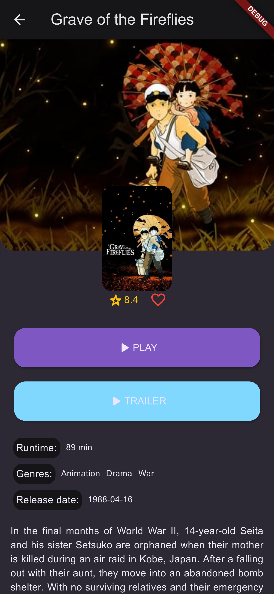
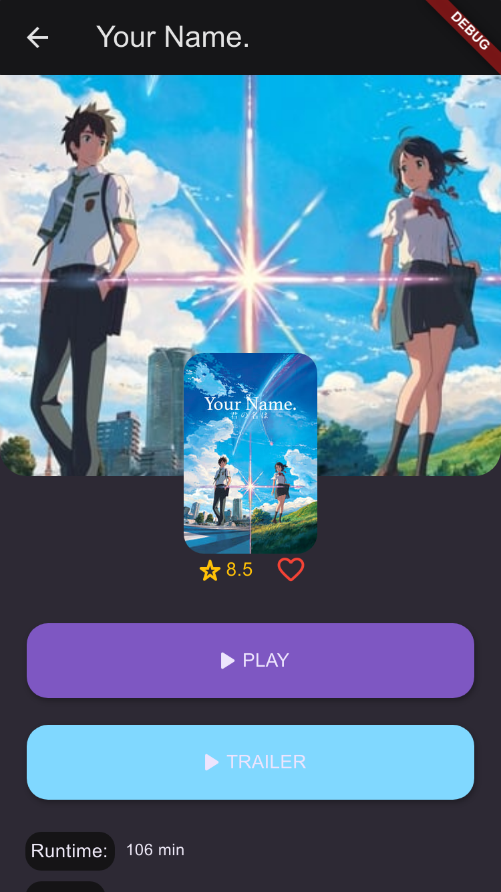
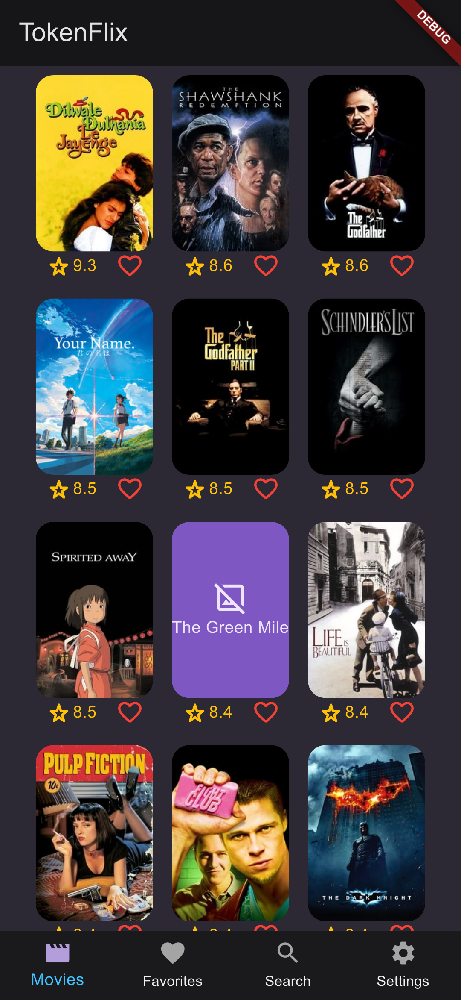
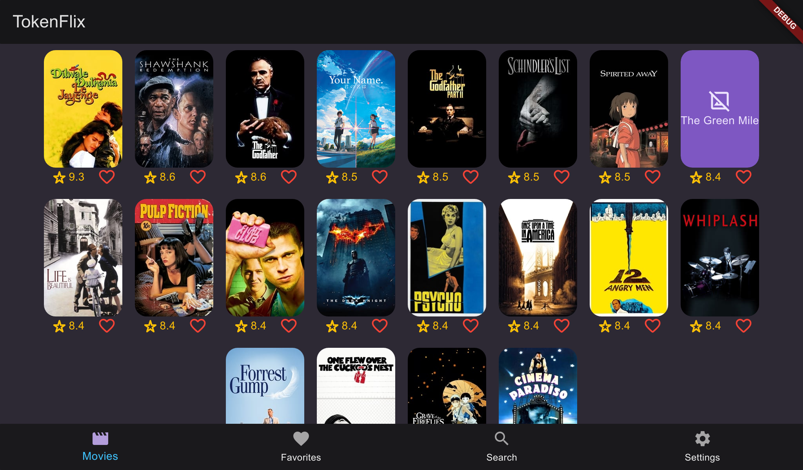
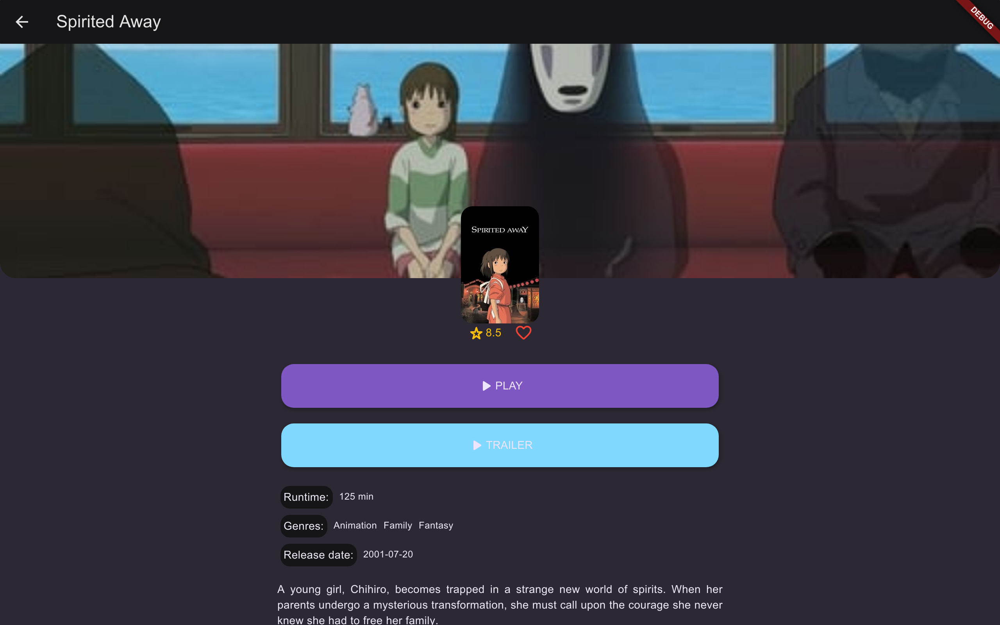

# TokenFlix

O desafio consiste em elaborar um aplicativo que obtenha os dados desta API, apresentando-os de forma simples e acessível, seguindo os padrões de usabilidade da plataforma. Preze pela qualidade e não pela velocidade, utilize o tempo que lhe foi dado da melhor forma possível.

O projeto do TokenFlix foi desenvolvido em Flutter. O TokenFlix foi desenvolvido em Flutter. O TokenFlix consome a API REST disponibilizada no desafio e exibi os filmes em um catálogo virtual. Inicialmente, o usuário pode ver o poster do filme, seu rating e se ela está favoritada. Ao clicar no poster do filme, o usuário é redirecionado para a página de detalhes do filme, onde poderá ver mais informações sobre ele, como a sua sinopse.

    <video src="docs/video.webm" type="video/webm" width=95%>

    
    
    
    
    
    

