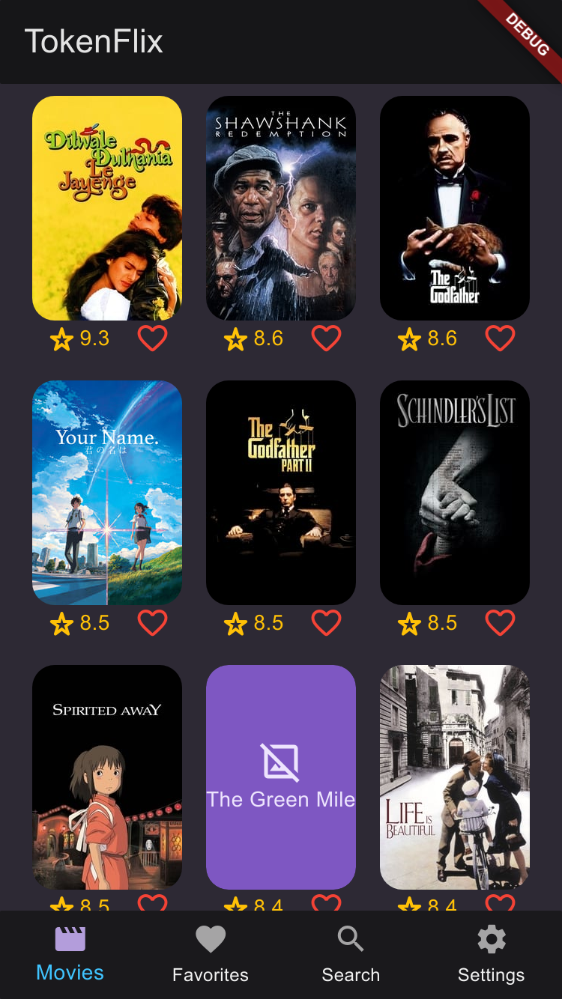

# **TokenFlix**

O desafio consiste em elaborar um aplicativo que obtenha os dados desta API, apresentando-os de forma simples e acessível, seguindo os padrões de usabilidade da plataforma. Preze pela qualidade e não pela velocidade, utilize o tempo que lhe foi dado da melhor forma possível.

    O TokenFlix foi desenvolvido em Flutter. O TokenFlix consome a API REST disponibilizada no desafio e exibi os filmes em um catálogo virtual. Inicialmente, o usuário pode ver o poster do filme, seu rating e se está favoritado. Ao clicar no poster do filme, o usuário é redirecionado para a página de detalhes do filme, onde poderá ver mais informações sobre ele, como a sua sinopse.

## **Arquitetura**
A arquitetura escolhida para o projeto foi a MVC. Essa arquitetura é amplamente utilizada em aplicações web e permite uma melhor separação dos componentes da aplicação, o que facilita o desenvolvimento e a manutenção do código. Além disso, a MVC é compatível com diversas tecnologias e padrões web, o que torna mais fácil integrar novos recursos no projeto.

## **Packages**
| Name | Version |
| :--  |   --:  |
| **http** |   |
| **provider** |  |
| **flex_color_scheme** |  |
| **cached_network_image** |  |

    
    
    
    
    
    
    
    

